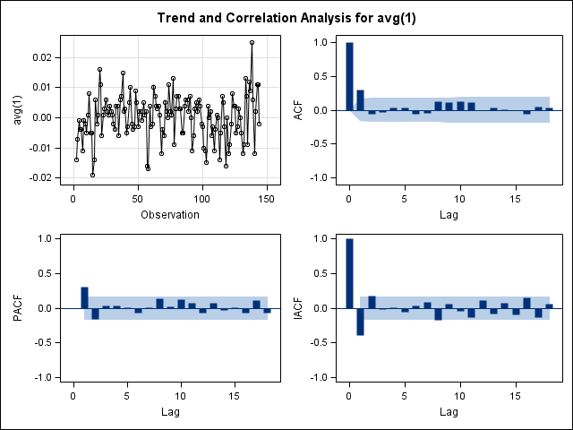
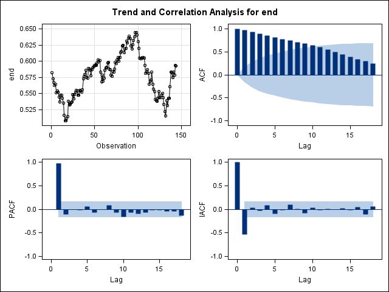
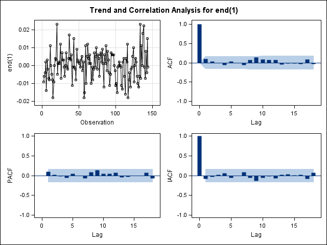
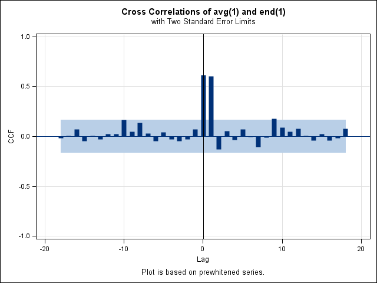

```{r global_options, include=FALSE}
options(digits = 3)
options(xtable.comment = FALSE)
options(xtable.table.placement = "!h")

library(knitr)
library(xtable)
```
##Question 1

```{r echo=FALSE, }
source("binaryHMMRcode.r")
MelbourneRain <- read.table("MelbourneAirport.txt",header=TRUE)
attach(MelbourneRain)
```

###i)

The overall proportion of rainy days to sunny days is `r mean(Rain)`. The proportion of rainy days seems to increase over the (Southern Hemisphere) winter months and decreases over the summer months.

```{r, cache=TRUE}
mean(Rain)
plot(tapply(Rain,Month,mean))
```

###ii)

For $m = 1$:

```{r, cache=TRUE}
m <- 1
pi0 <- c(mean(Rain))
gamma0 <- matrix(c(1),nrow=m)
Melbourne.mle1 <- binary.HMM.mle(Rain,m,pi0,gamma0)
```

The fitted parameter values are:

$$\boldsymbol{\pi} = \left( \pi_1 \right) = \left( `r Melbourne.mle1$pi[1]` \right)$$

and

$$\boldsymbol{\Gamma} = \left( `r Melbourne.mle1$gamma[1]` \right)$$

For $m = 2$:

```{r, cache=TRUE}
m <- 2
pi0 <- c(0.001,0.9)
gamma0 <- matrix(c(0.8,0.2,0.4,0.6),nrow=m,byrow=TRUE)
Melbourne.mle2 <- binary.HMM.mle(Rain,m,pi0,gamma0)
```

The fitted parameter values are:

$$\boldsymbol{\pi} = \left( \pi_1, \pi_2 \right) = \left( `r round(Melbourne.mle2$pi[1],3)`, `r Melbourne.mle2$pi[2]` \right)$$

and

$$\boldsymbol{\Gamma} =  
 \begin{pmatrix}
   `r Melbourne.mle2$gamma[1,1]` & `r Melbourne.mle2$gamma[1,2]` \\
   `r Melbourne.mle2$gamma[2,1]` & `r Melbourne.mle2$gamma[2,2]`
 \end{pmatrix} 
$$

For $m = 3$:

```{r, cache=TRUE}
m <- 3
pi0 <- c(0.01,0.5,0.99)
gamma0 <-matrix(c(0.8,0.1,0.1,0.1,0.8,0.1,0.2,0.2,0.6),nrow=m,byrow=TRUE)
Melbourne.mle3 <- binary.HMM.mle(Rain,m,pi0,gamma0)
```

The fitted parameter values are:

$$\boldsymbol{\pi} = \left( \pi_1, \pi_2 \, \pi_3 \right) = \left( `r Melbourne.mle3$pi[1]`, `r Melbourne.mle3$pi[2]`, `r Melbourne.mle3$pi[3]` \right)$$

and

$$\boldsymbol{\Gamma} =  
 \begin{pmatrix}
   `r Melbourne.mle3$gamma[1,1]` & `r Melbourne.mle3$gamma[1,2]` & `r Melbourne.mle3$gamma[1,3]` \\
   `r Melbourne.mle3$gamma[2,1]` & `r Melbourne.mle3$gamma[2,2]` & `r Melbourne.mle3$gamma[2,3]` \\
   `r Melbourne.mle3$gamma[3,1]` & `r Melbourne.mle3$gamma[3,2]` & `r Melbourne.mle3$gamma[3,3]` \\
 \end{pmatrix} 
$$

###iii)

```{r results='asis', echo=FALSE}
  diag = as.data.frame(rbind(
        c(Melbourne.mle1$mllk, Melbourne.mle1$AIC, Melbourne.mle1$BIC),
        c(Melbourne.mle2$mllk, Melbourne.mle2$AIC, Melbourne.mle2$BIC),
        c(Melbourne.mle3$mllk, Melbourne.mle3$AIC, Melbourne.mle3$BIC)))
  
  colnames(diag) = c("mllk", "AIC", "BIC")
  
  xtable(diag)
```
As can be seen in the table, $m = 3$ minimises both the AIC and the BIC and therefore should be chosen as the most appropriate.

As $\pi_1 \approx 0$ and two of the $\gamma_{ij}$ are also close to zero, three of the natural parameters are close to their boundary values and this could cause convergence issues. A modified HMM could be used where $\pi_1 = 0$. 

###iv)

```{r}
m <- 3
pi <- Melbourne.mle3$pi
gamma <- Melbourne.mle3$gamma
Melbourne.mle3probs <- binary.HMM.state_probs(MelbourneRain$Rain,m,pi,gamma)
Melbourne.mle3local <- binary.HMM.local_decoding(MelbourneRain$Rain,m,pi,gamma)
Melbourne.mle3global <- binary.HMM.viterbi(MelbourneRain$Rain,m,pi,gamma)
p1 <- round(Melbourne.mle3probs[1,],3)
p2 <- round(Melbourne.mle3probs[2,],3)
p3 <- round(Melbourne.mle3probs[3,],3)
ld <- Melbourne.mle3local
gd <- Melbourne.mle3global
Melbournedecode <- cbind(MelbourneRain,p1,p2,p3,ld,gd)
Melbournedecode.txt <- write.table(Melbournedecode,file="Melbournedecode.txt",
                                  quote = FALSE,sep="\t", row.names = FALSE)

decode = read.table(file="Melbournedecode.txt", header = TRUE)
```
```{r results='asis', echo=FALSE}
xtable(head(decode))
```

\newpage

###v)

The following tables show that local and global decoding do largely agree, except in the decoding of state 2, where local decoding will identify it around twice as often as global decoding.

```{r echo=FALSE}
table(ld)
table(gd)
table(ld,gd)
```

The following table shows the date periods which according to global decoding are in state 2: 

```{r results='asis', echo=FALSE}
dates = as.data.frame(rbind(
c("1971-06-15","1971-11-28"),
c("1980-06-29","1980-08-15"),
c("1981-05-24","1981-08-22"), 
c("1986-08-16","1986-11-01"),
c("1989-05-23","1989-10-15"),
c("1991-06-03","1991-09-27"),
c("1992-08-10","1992-10-10"),
c("1996-06-05","1996-10-05")))

colnames(dates) = c("From", "To")

print(xtable(dates), floating=F)
```


The following contingency tables show that (according to both local and global decoding) state 1 is strongly associated with rainy days and state 2 is strongly associated with dry days. State 3 can be characterised as having mixed periods.

```{r echo=FALSE}
table(Rain, gd)
table(Rain, ld)
```


\newpage

##Question 2

```{r echo=FALSE}
read_chunk("Question2-i.sas", labels = "Question2-i")
read_chunk("Question2-ii.sas", labels = "Question2-ii")
read_chunk("Question2-ii-results.lst", labels = "Question2-ii-results", from = 1, to=19)
read_chunk("Question2-ii-results.lst", labels = "Question2-ii-forecasts", from = 20)
read_chunk("Question2-ii-diagnosis.lst", labels = "Question2-ii-diagnosis")
read_chunk("Question2-iii.sas", labels = "Question2-iii")
```

###i)

The following SAS code was used to identify and estimate appropriate univariate ARIMA models for each of the `avg` and `end` exchange rate time series:

```{r Question2-i, engine='sas', eval=FALSE}

```

The diagnostics plots indicates that the first difference of `avg` has an ACF cut-off at lag 1, thereby leading us to believe the data follows an Arima(0,1,1) model with the following model equation:

$$\Delta Y_t = -0.36347 \epsilon_{t-1} +  \epsilon_t$$



\newpage

In addition the Ljung-Box chi-square statistics do not have any significant p-values, giving further weight to the chosen model:

```
                             Autocorrelation Check of Residuals

 To        Chi-             Pr >
Lag      Square     DF     ChiSq    --------------------Autocorrelations--------------------

  6        1.30      5    0.9346    -0.010    -0.041    -0.034     0.032     0.046    -0.051
 12        8.50     11    0.6681    -0.071     0.133     0.046     0.079     0.104    -0.066
 18       11.49     17    0.8299     0.059    -0.022     0.030    -0.087     0.075     0.015
 24       16.13     23    0.8497    -0.014    -0.121    -0.044    -0.074    -0.025    -0.066


```

`end` is found to follow an AR(1) model with the following model equation:

$$Y_t = 0.58167 + 0.96945 Y_{t-1} + \epsilon_t$$

This model was identified by the lag 1 cut-off in the PACF as shown in the diagnostics plots below:



In addition the Ljung-Box chi-square statistics do not have any significant p-values, giving further weight to the chosen model:
```
                            Autocorrelation Check of Residuals

 To        Chi-             Pr >
Lag      Square     DF     ChiSq    --------------------Autocorrelations--------------------

  6        2.84      5    0.7239     0.116     0.043     0.007    -0.048     0.040     0.006
 12       11.19     11    0.4279    -0.050     0.081     0.153     0.092     0.081     0.076
 18       13.25     17    0.7192    -0.035    -0.019    -0.019    -0.022     0.095    -0.033
 24       18.91     23    0.7064    -0.024    -0.076    -0.109    -0.044    -0.028    -0.108
```

\newpage

###ii)

The following SAS code identifies and fits a VAR(p) model to the bivariate data:

```{r Question2-ii, engine='sas', eval=FALSE}

```

Which gives the following truncated output:

```{r Question2-ii-results, engine='sas', eval=FALSE}

```
Based off which the fitted model is as follows:

$$\begin{pmatrix}
   x_t \\
   y_t 
 \end{pmatrix} = 
 \begin{pmatrix}
   .03600 & 0.11050 \\
   .70995 & 0.22236
 \end{pmatrix} 
 \begin{pmatrix}
   x_{t-1} \\
   y_{t-1} 
 \end{pmatrix} + \epsilon_t
$$

The following Portmanteau Statistics shows significant p-values at all lags indicating that this VAR(1) model does not fit adequatly: 

```{r Question2-ii-diagnosis, engine='sas', eval=FALSE}

```

The following outputs show the forecasts of the average exchange rate for the next three months of 2006 are: 0.59273, 0.59261, 0.59261  

```{r Question2-ii-forecasts, engine='sas', eval=FALSE}

```

\newpage

###iii)

The following SAS code was used to identify and estimate an appropriate transfer function model where `avg` was specified as the output variable and `end` the input variable:

```{r Question2-iii, engine='sas', eval=FALSE}

```

The following diagnostics plots show from the lag 1 cutoff that an ARIMA(0,1,1) model is appropriate for the first difference of `end`: 



Hence the estimation procedure shows the following model for `end`:

$$\Delta X_t = \eta_t +  0.09801 \eta_{t-1}$$

The following output shows the p-values from the portmanteau statistics indicate the model fits well: 

```
                 Autocorrelation Check of Residuals

 To        Chi-             Pr >
Lag      Square     DF     ChiSq    --------------------Autocorrelations--------------------

  6        0.95      5    0.9668     0.003     0.029    -0.003    -0.065     0.035    -0.003
 12        7.14     11    0.7880    -0.069     0.066     0.134     0.066     0.062     0.069
 18        9.75     17    0.9136    -0.045    -0.017    -0.018    -0.034     0.101    -0.044
 24       14.42     23    0.9143    -0.015    -0.067    -0.102    -0.033    -0.013    -0.105
```

The next statement shows the output of the second `identify` statement which shows the following cross-correlation function:



This indicates that the transfer function is in the form of a lag-1 pulse function. There is a sharp (not decayed) response after lag 1 which indicates a transfer function of the form: 

$$Y_t = \omega X_t + U_t$$

NB: The lack of intercept is due to the first differencing, and the lack of denominator terms due to the pulse intervention

With the subsequent estimation run, SAS provides us the estimated model of:

$$Y_t = (1.1118 - 0.14899 L) X_{t-1} + U_t$$

Where $$U_t = (1 - 0.95978 L) \epsilon_t$$

```
                                The ARIMA Procedure

                               Moving Average Factors

                            Factor 1:  1 - 0.95978 B**(1)


                                   Input Number 1

                          Input Variable               end
                          Shift                          1
                          Period(s) of Differencing      1


                                  Numerator Factors

                          Factor 1:  1.1118 - 0.14899 B**(1)
```

The forecast values for `avg` are given as:

```
                             Forecasts for variable avg

            Obs       Forecast    Std Error       95% Confidence Limits

            145         0.5924       0.0051         0.5824         0.6024
            146         0.5922       0.0104         0.5719         0.6125
            147         0.5923       0.0135         0.5658         0.6188


```

```{r eval = FALSE, echo=FALSE}
library(zoo)
library(forecast)
latdol.zoo <- read.zoo("LatDol.dat", 
                        index.column = 1:2, 
                        FUN = function(year, month){ as.yearmon(paste(year, month, sep = "-"))})
colnames(latdol.zoo) = c("Avg", "End")

#plot(latdol.zoo)
#plot(diff(latdol.zoo))

#acf(latdol.zoo$Avg)
#acf(diff(latdol.zoo$Avg))
acf(latdol.zoo$Avg, type='partial') #!!!

#fitAvg <- auto.arima(latdol.zoo$Avg)
#plot(forecast(fitAvg,h=20))
arima(latdol.zoo$Avg, order = c(0,1,1))

#acf(latdol.zoo$End)
#acf(diff(latdol.zoo$End))
acf(latdol.zoo$End, type='partial') #!!!
#acf(diff(latdol.zoo$End), type='partial')

#fitEnd <- auto.arima(latdol.zoo$End)
#plot(forecast(fitEnd,h=20))
arima(latdol.zoo$End, order = c(1,0,0))

plot(latdol.zoo$End, ylim=range(latdol.zoo$End, latdol.zoo$Avg))
lines(latdol.zoo$Avg, col=2)

prewhiten(latdol.zoo$Avg, latdol.zoo$End)
ccf(latdol.zoo$Avg, latdol.zoo$End)

```